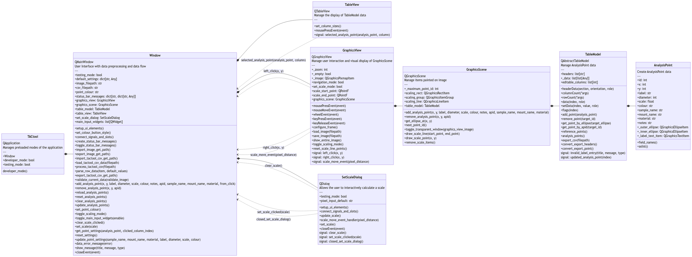

# TACtool

> A graphical tool for selecting points for analysis on an SEM image

## Download

You can download the **TACtool** application here:

- [Windows](https://github.com/BritishGeologicalSurvey/tactool/releases/latest/download/windows-tactool.exe)
- [MacOS](https://github.com/BritishGeologicalSurvey/tactool/releases/latest/download/macos-tactool.zip)

Instructions for using the application can be found [here](https://github.com/BritishGeologicalSurvey/tactool/blob/main/instructions.md).

## Original Contributors

TACTool was initially developed within the British Geological Survey by:
- Connor Newstead
- Dan Sutton
- Declan Valters
- Leo Rudczenko
- John A Stevenson

The original idea was by Connor Newstead and Matt Horstwood.


## Development

### Installation

Check out the repository and install dependencies using Anaconda.

#### Windows
```bash
conda env create -f environments/windows-environment.yml
conda activate tactool-windows
```

#### MacOS
```bash
conda env create -f environments/macos-environment.yml
conda activate tactool-macos
```

### Running the Program

To run the program, first you need to setup your Python path.

#### Windows
```bash
$env:PYTHONPATH="."
```

#### MacOS
```bash
export PYTHONPATH=.
```

Then you can run the program with:

```bash
python tactool/main.py --dev
```

The `--dev` flag starts the application in developer mode, with a test image
pre-loaded into the GraphicsView.

### Class Relationship Diagram

<details>
    <summary>Mermaid JS Code</summary>

    classDiagram
        direction LR

        class TACtool{
            QApplication
            Manages preloaded modes of the application
            ---
            +testing_mode: bool
            +window: Window
            +graphics_view: GraphicsView
            +graphics_scene: GraphicsScene
            +table_model: TableModel
            +table_view: TableView
            +set_scale_dialog: Optional[SetScaleDialog]
            +recoordinate_dialog: Optional[RecoordinateDialog]

            developer_mode()
        }

        class Window {
            QMainWindow
            Main User Interface with data flow
            ---
            +testing_mode: bool
            +default_settings: dict[str, Any]
            +image_filepath: Optional[str]
            +csv_filepath: Optional[str]
            +point_colour: str
            +graphics_view: GraphicsView
            +graphics_scene: GraphicsScene
            +table_model: TableModel
            +table_view: TableView
            +set_scale_dialog: Optional[SetScaleDialog]
            +recoordinate_dialog: Optional[RecoordinateDialog]
            +current_message: Optional[QMessageBox]
            +menu_bar: QMenuBar
            +menu_bar_file: QMenu
            +menu_bar_file_import_image: QAction
            +menu_bar_file_export_image: QAction
            +menu_bar_file_import_tactool_csv: QAction
            +menu_bar_file_export_tactool_csv: QAction
            +menu_bar_recoordinate_csv: QAction
            +status_bar: QStatusBar
            +sample_name_input: QLineEdit
            +mount_name_input: QLineEdit
            +material_input: QLineEdit
            +label_input: QComboBox
            +colour_button: QPushButton
            +diameter_input: QSpinBox
            +scale_value_input: QLineEdit
            +set_scale_button: QPushButton
            +clear_points_button: QPushButton
            +reset_ids_button: QPushButton
            +reset_settings_button: QPushButton
            +status_bar_messages: dict[str, dict[str, Any]]
            +main_input_widgets: list[QWidget]
            +dialogs: list[QDialog]

            +setup_ui_elements()
            +connect_signals_and_slots()
            +set_colour_button_style()
            +create_status_bar_messages()
            +toggle_status_bar_messages()
            +import_image_get_path()
            +export_image_get_path()
            +import_tactool_csv_get_path()
            +load_tactool_csv_data(filepath)
            +export_tactool_csv_get_path()
            +validate_current_data(validate_image)
            +add_analysis_point(x, y, label, diameter, scale, colour, notes, apid, sample_name, mount_name, material, from_click)
            +reload_analysis_points(index, transform)
            +clear_analysis_points()
            +remove_analysis_point(x, y, apid)
            +set_point_colour()
            +get_point_settings(analysis_point, clicked_column_index)
            +reset_settings()
            +update_point_settings(sample_name, mount_name, material, label, diameter, scale, colour)
            +toggle_main_input_widgets(enable)
            +set_scale(scale)
            +toggle_scaling_mode()
            +toggle_recoordinate_dialog()
            +data_error_message(error)
            +show_message(title, message, type)
            +closeEvent(event)
        }

        class TableView{
            QTableView
            Manage the display of TableModel data
            ---
            +format_columns()
            +mousePressEvent(event)
            +signal: selected_analysis_point(analysis_point, column)
        }

        class GraphicsView{
            QGraphicsView
            Manage user interaction and visual display of GraphicsScene
            ---
            +_zoom: int
            +_empty: bool
            +_image: QGraphicsPixmapItem
            +disable_analysis_points: bool
            +navigation_mode: bool
            +scaling_mode: bool
            +scale_start_point: QPointF
            +scale_end_point: QPointF
            +graphics_scene: GraphicsScene

            +mousePressEvent(event)
            +mouseMoveEvent(event)
            +wheelEvent(event)
            +keyPressEvent(event)
            +keyReleaseEvent(event)
            +configure_frame()
            +load_image(filepath)
            +save_image(filepath)
            +show_entire_image()
            +toggle_scaling_mode()
            +reset_scaling_elements()
            +signal: left_click(x, y)
            +signal: right_click(x, y)
            +signal: scale_move_event(pixel_distance)
        }

        class SetScaleDialog{
            QDialog
            Allows the user to interactively calculate a scale
            ---
            +testing_mode: bool
            +pixel_input_default: str
            +set_scale_button: QPushButton
            +clear_scale_button: QPushButton
            +cancel_button: QPushButton
            +distance_input: QSpinBox
            +pixel_input: QLineEdit
            +scale_value: QLineEdit

            +setup_ui_elements()
            +connect_signals_and_slots()
            +update_scale()
            +scale_move_event_handler(pixel_distance)
            +set_scale()
            +clear_scale()
            +closeEvent(event)
            signal: clear_scale_clicked()
            signal: set_scale_clicked(scale)
            signal: closed_set_scale_dialog()
        }

        class RecoordinateDialog{
            QDialog
            Allows the user to recoordinate an SEM CSV file
            ---
            +testing_mode: bool
            +ref_points: list[AnalysisPoint]
            +image_size: QSize
            +input_csv_button: QPushButton
            +input_csv_filepath_label: QLineEdit
            +output_csv_button: QPushButton
            +output_csv_filepath_label: QLineEdit
            +recoordinate_button: QPushButton
            +cancel_button: QPushButton

            +setup_ui_elements()
            +connect_signals_and_slots()
            +get_input_csv()
            +get_output_csv()
            +recoordinate_and_export()
            +recoordinate_sem_points(input_csv, output_csv, invert_x_axis_dest, x_header, y_header, ref_col, ref_label)
            +closeEvent(event)
            signal: show_message(title, message, type)
            signal: closed_recoordinate_dialog()
        }

        class GraphicsScene{
            QGraphicsScene
            Manage items painted on image
            ---
            +scaling_rect: QGraphicsRectItem
            +scaling_group: QGraphicsItemGroup
            +scaling_line: QGraphicsLineItem
            +table_model: TableModel

            +add_analysis_point(apid, x, y, label, diameter, scale, colour, notes, sample_name, mount_name, material)
            +remove_analysis_point(x, y, apid)
            +get_ellipse_at(x, y)
            +toggle_transparent_window(graphics_view_image)
            +draw_scale_line(start_point, end_point)
            +draw_scale_point(x, y)
            +remove_scale_items()
        }

        class TableModel{
            QAbstractTableModel
            Manage AnalysisPoint data
            ---
            +headers: list[str]
            +_data: list[list[Any]]
            +editable_columns: list[int]
            +public_headers: list[str]
            +analysis_points: list[AnalysisPoint]
            +reference_points: list[AnalysisPoint]
            +next_point_id: int

            +headerData(section, orientation, role)
            +columnCount(*args)
            +rowCount(*args)
            +data(index, role)
            +setData(index, value, role)
            +flags(index)
            +add_point(analysis_point)      
            +remove_point(target_id)
            +get_point_by_ellipse(target_ellipse)
            +get_point_by_apid(target_id)
            signal: invalid_label_entry(title, message, type)
            signal: updated_analysis_point(index)
        }

        class AnalysisPoint{
            Create AnalysisPoint data
            ---
            +id: int
            +label: str
            +x: int
            +y: int
            +diameter: int
            +scale: float
            +colour: str
            +sample_name: str
            +mount_name: str
            +material: str
            +notes: str
            +_outer_ellipse: QGraphicsEllipseItem
            +_inner_ellipse: QGraphicsEllipseItem
            +_label_text_item: QGraphicsTextItem

            +field_names()
            +aslist()
        }

        class analysis_point{
            Functions for AnalysisPoint processing
            ---

            +parse_tactool_csv(filepath, default_settings)
            +parse_row_data(item, fields)
            +export_tactool_csv(filepath, headers, analysis_points)
            +convert_export_headers(headers)
            +convert_export_point(analysis_point, headers)
            +parse_sem_csv(filepath, required_headers)
            +export_sem_csv(filepath, headers, points)
            +reset_id(analysis_point)
            +affine_transform_matrix(source, dest)
            +affine_transform_point(matrix, point)
        }

        TACtool *-- Window
        Window *-- GraphicsView
        Window *-- TableView
        Window *-- SetScaleDialog
        Window *-- RecoordinateDialog
        GraphicsView *-- GraphicsScene
        GraphicsScene *-- TableModel
        TableModel *-- AnalysisPoint
        AnalysisPoint *-- analysis_point

        Window <.. TableView : selected_analysis_point(analysis_point, column)
        Window <.. SetScaleDialog : clear_scale_clicked()
        Window <.. SetScaleDialog : set_scale_clicked(scale)
        Window <.. SetScaleDialog : closed_set_scale_dialog()
        Window <.. RecoordinateDialog : show_message(title, message, type)
        Window <.. RecoordinateDialog : closed_recoordinate_dialog()
        Window <.. GraphicsView : left_click(x, y)
        Window <.. GraphicsView : right_click(x, y)
        Window <.. GraphicsView : scale_move_event(pixel_distance)

</details>



### Testing

Ensure you have setup your Python path. Then you can run the tests with:

```bash
pytest -vv test/
```

#### List of Tests

**test_import_export.py**
- test_export_image
- test_import_tactool_csv
- test_export_tactool_csv

**test_integration.py**
- test_add_and_remove_points
- test_clear_points
- test_reset_id_values
- test_reset_settings
- test_reference_point_hint

**test_model.py**
- test_analysis_point_public_attributes_match
- test_model

**test_scaling.py**
- test_toggle_scaling_mode
- test_set_scale
- test_scale_hint

**test_transformation.py**
- test_affine_transform_point
- test_affine_transform_matrix
- test_toggle_recoordinate_dialog
- test_recoordinate_sem_points

### Create a standalone executable using PyInstaller

```
pyinstaller --name="TACtool" --windowed --paths=. --onefile tactool/main.py
```
Run the above code and a .spec file and dist/ build/ directories will be created.

## Licence

TACtool is distributed under the [GPL v3.0 licence](LICENSE).

Copyright: © BGS / UKRI 2023
