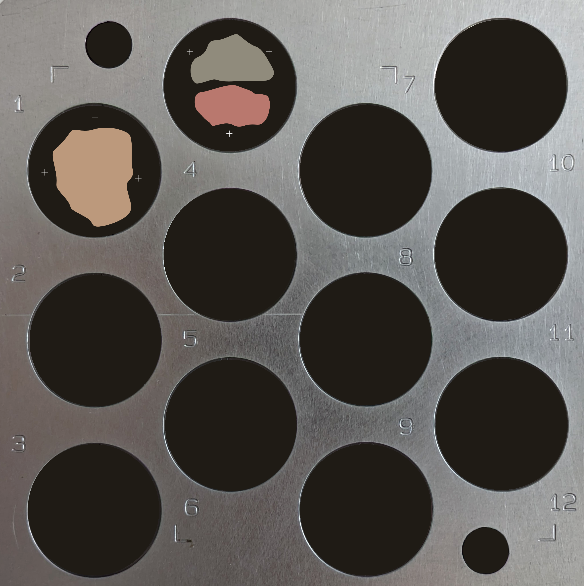
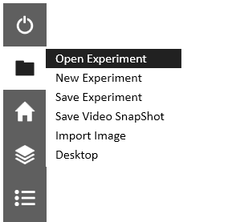
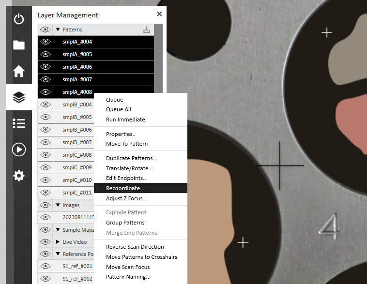
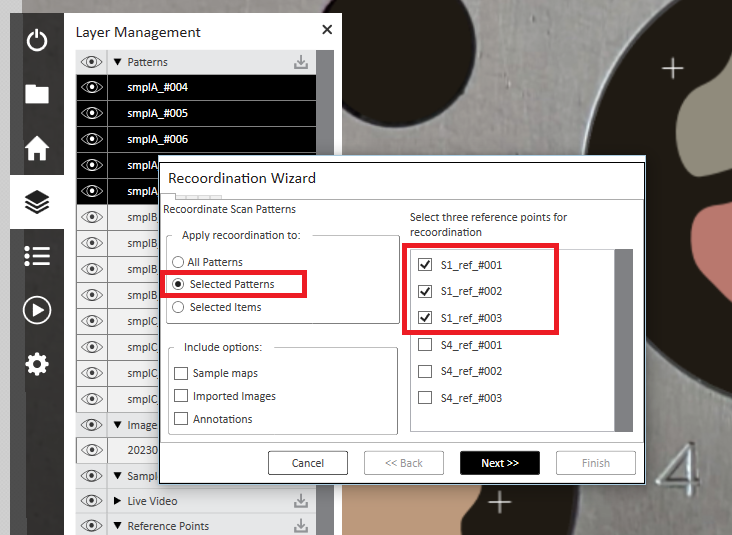
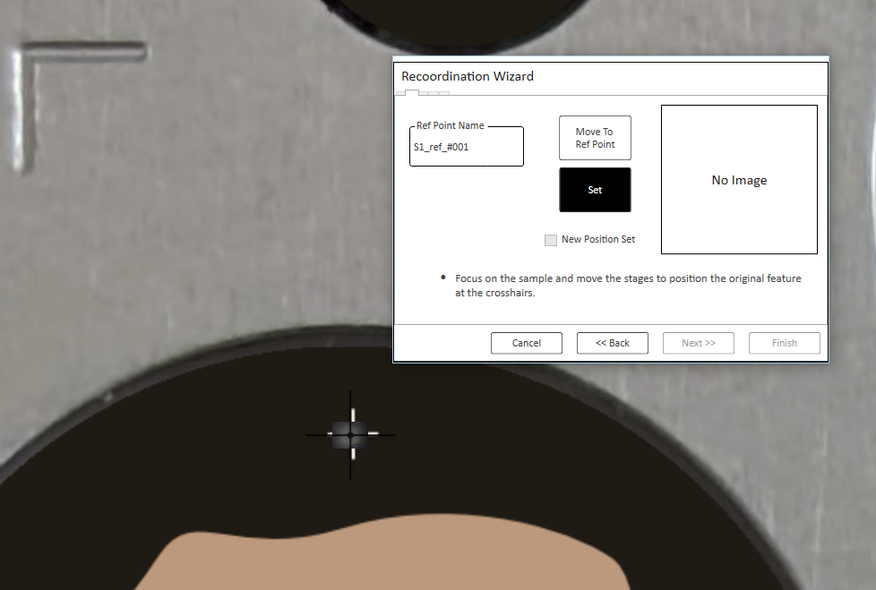
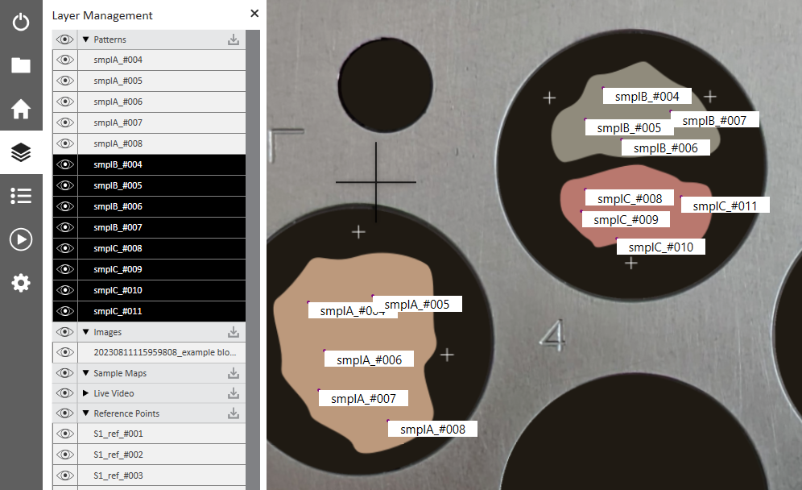

# Importing TACtool CSV to an ESI laser

This guide will help use the exported TACtool CSV in the laser control software from ESI (other manufacturers will differ).

These steps show how to import spots from multiple TACtool files into the same experiment – e.g., if you have multiple independent mounts which need re-coordinating separately. The only way to do this at the moment in the ESI software is with a bit of manual editing of the TACtool CSVs.

> If you only have one mount, you can ignore any instructions below which tell you to go back and repeat steps.

Follow the [instructions](instructions.md) to generate your TACtool files for each mount. Make sure you include three reference points for each before adding the target spots and then File > export TACtool CSV for each.

In our example, we have two CSV files, but the ESI platform will only open one CSV at a time. To get around this, we can manually merge the two CSVs and import that: open both CSVs in a text editor and copy all rows except the header from the second into the bottom of the first CSV. Make sure you copy all the ref_marks.

Now we can load our two one-inch round mounts into the laser's sample holder. The mounts contain three samples: sample A in one (in the holder's slot 1) and B and C in another (in slot 4).

> It's a good idea to take a photo at this point, both for reference later, and to use as a map in the laser software. Our photo looks like this:
>
> 

Then load the sample holder into the laser and begin laying the spots:

1. :file_folder: > Open Experiment

    

2. Show file types `*.CSV`
3. Open your combined spots CSV file
4. Make sure the laser software has added all your spots at the right size
5. Add a background image or make a sample map

    > Note: you must do this step *after* importing the CSV.

    This will make navigating around the stage much easier. The simplest way is just to take a photo of the block before loading it, transfer the photo to the laser PC, and then import it and recoordinate it. You can also get the laser to make a mosaic map, but it takes much longer.

    1. :file_folder: > Import Image
    2. Move the laser stage to one of the reference marks engraved into the metal
    3. Using the **pointer** tool, click in the main video to register the mark
    4. Move the stage to a second reference mark
    5. Select point in main video again
    6. Now select the corresponding points on your block map image, in the same order that you visited them with the laser

        > Don't press spacebar to pan! It can click the back button and undo all your work

6. Save the project (as a `.LAX` file) in case you need to restart the re-coordinating (there is no undo!)
7. Layers icon > patterns > shift+click to select only the patterns in the first slot

    > Include all the patterns in the mount, even if they're from different samples. They will all need the same re-coordination using the same reference marks.

    

8. Right click > **Recoordinate...**
9. Make sure the slot 1 reference marks are selected

    

10. Make sure "Apply recoordination to" is set to "Selected Patterns"
11. Click "**Next >>**"
12. Move to the first reference mark and set the focus
13. Click "**Set**"

    

14. Click "**Next >>**" (make sure you do this): it will select Ref Point 2
15. Move the stage to each reference point in turn and repeat steps 12+13
16. Click "**Finish**" and it should magically move all your spots to the right places!
17. Check any spots where a few microns displacement would be problematic.
18. Save the project again
19. Select only patterns in the next slot (slot 4 in this example) and repeat steps 7-17
20. Done! Save the experiment again.

    

21. Add any other spots manually (e.g. other samples, standards)
22. Add to queue and run (beyond our scope here!)
